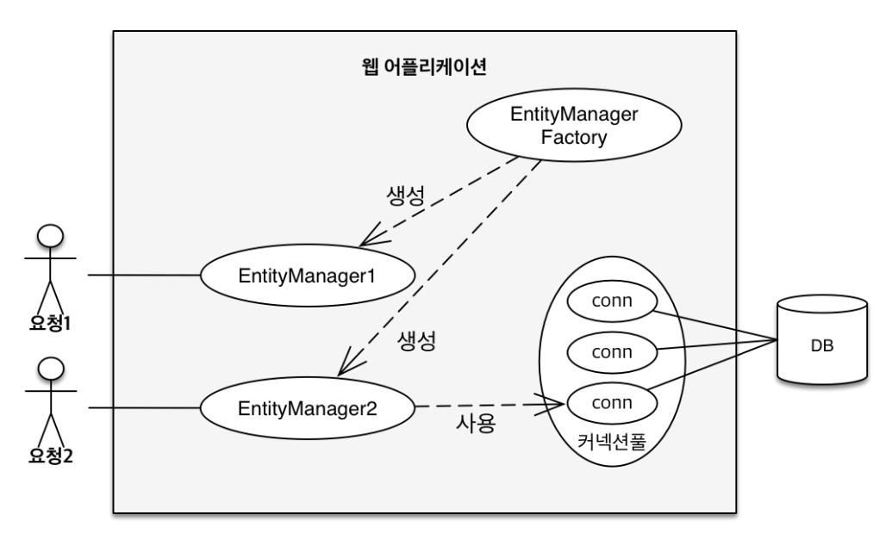

# Chapter3. 영속성 관리 - 내부 동작 방식

**Keyword**
#Persistence_Context #Flush #Persist #Dirty_checking

### JPA 에서 가장 중요한 2가지

1. 객체와 관계형 DB 매핑 (Object Relational Mapping)
  - 설계
2. 영속성 컨텍스트
  - 내부적으로 어떻게 동작하는지

# 영속성 컨텍스트(Persistence Context)

- 새로운 요청이 올 때마다 EntityManager를 생성한다



## 영속성 컨텍스트

- 엔터티를 영구 저장하는 논리적인(logical) 환경
- `EntityManager.persist(entity);` : 영속성 컨텍스트에 저장
- EntityManager을 통해 영속성 컨텍스트에 접근한다
- EntityManager와 영속성 컨텍스트가 1:1 (J2SE환경 ?)
  - EntityManager 1 : 1 PersistenceContext

## 엔터티의 생명주기

- 비영속(new/transient)
  - Persistence Context와 전혀 관계가 없는 새로운 상태
- 영속(managed)
  - Persistence Context에 관리되는 상태
- 준영속(detached)
  - Persistence Context에 저장되었다가 분리된 상태
- 삭제(removed)
  - 삭제된 상태


```java
// 객체를 생성한 상테(비영속)
Member member = new Member();
member.setId(1L);
member.setName("회원1");
    
// 객체를 저장한 상태(영속)
em.persist(member);

// 준영속 detached
em.detach(member);

// 객체를 삭제한 상태
em.remove(member);
```

---

em.persist 했을 때 쿼리가 실행되는 것이 아님

commit() 할 때 실행 됨.

em.remove() 는 실제로 지우는 코드

flush() ?

---

## Persistence Context의 이점

### 1. 엔터티 조회, 1차 캐시

- 일단 EntityManager를 Persistence Context 라고 여기기
- JPA는 `em.find(Member.class, "member1");` 을 하면 DB를 조회하지 않고 1차 캐시에서 먼저 조회함
- 사실 그렇게 이득이 있지 않음. 찰나의 순간에서 이점이 있지만 한 트랜잭션 안에서 만 효과가 있음

> 예제1

```java
package hellojpa;

import javax.persistence.EntityManager;
import javax.persistence.EntityManagerFactory;
import javax.persistence.EntityTransaction;
import javax.persistence.Persistence;

public class JpaMain{
  public static void main(String[] args){
    EntityManagerFactory emf = Persistence.createEntityManagerFactory("hello");

    EntityManager em = emf.createEntityManager();

    EntityTransaction tx = em.getTransaction();

    tx.begin();

    try{
      // 비영속
      Member member = new Member();
      member.setId(101L);
      member.setName("1차 캐시 조회 테스트");

      // 영속
      em.persist(member);

      Member findMember = em.find(Member.class, 101L);

      System.out.println("member.id = " + findMember.getId());
      System.out.println("member.name = " + findMember.getName());

      tx.commit();
    } catch (Exception e){
      tx.rollback();
    } finally {
      em.close();
    }
    emf.close();
  }
}
```

- 결과는 ?

  ```java
  member.id = 101
  member.name = 1차 캐시 조회 테스트
  Hibernate: 
      /* insert hellojpa.Member
          */ insert 
          into
              Member
              (name, id) 
          values
              (?, ?)
  ```

  - DB select 쿼리가 안 나감.
  - 1차 캐시에서 먼저 조회했기 때문

> 예제2

```java
Member findMember1 = em.find(Member.class, 101L);
Member findMember2 = em.find(Member.class, 101L);

System.out.println("member.id = " + findMember1.getId());
System.out.println("member.name = " + findMember1.getName());
```

- 결과

  ```java
  Hibernate: 
      select
          member0_.id as id1_0_0_,
          member0_.name as name2_0_0_ 
      from
          Member member0_ 
      where
          member0_.id=?
  member.id = 101
  member.name = 1차 캐시 조회 테스트
  ```

  - select 쿼리가 한 번 나감.

## 2. 영속 엔터티의 동일성 보장

> 예제 1

```java
Member findMember1 = em.find(Member.class, 101L);
Member findMember2 = em.find(Member.class, 101L);

System.out.println(findMember1 == findMember2);
```

- 결과
  - `true`
- 설명
  - 1차 캐시로 repeatable read (반복가능한 읽기) 등급의 트랜잭션 격리 수준을 DB가 아닌 애플리케이션 차원에서 제공해 준다.
  - 같은 트랜잭션에서 비교를 하면 동일성이 보장된다.

## 3. 엔터티 등록시 트랜잭션을 지원하는 쓰기 지연

```java
EntityManager em = emf.createEntityManager();
EntityTransaction transaction = em.getTransaction();//엔티티 매니저는 데이터 변경시 트랜잭션을 시작해야 한다.

transaction.begin(); // [트랜잭션] 시작

em.persist(memberA); // == 1차 캐시에 저장 & insert SQL 생성
em.persist(memberB); // == 1차 캐시에 저장 & insert SQL 생성
///여기까지 INSERT SQL을 데이터베이스에 보내지 않는다.

//커밋하는 순간 데이터베이스에 INSERT SQL을 보낸다.
transaction.commit(); // [트랜잭션] 커밋
// ==> flush -> db transaction commit
```

- buffer에 모아서 한 번에 `commit` 이 가능하다.

### 엔티티 수정 - 변경 감지 (dirty check)


1. 트랜잭션을 커밋(`transaction.commit()`)하면 엔티티 매니저 내부에서 먼저 `fulsh()` 가 호출된다
2. 엔터티와 스냅샷을 비교해서 변경된 엔터티를 찾는다
3. 변경된 엔터티가 있으면 수정 쿼리를 생성해서 쓰기 지연 SQL저장소에 보낸다.
4. 쓰기 지연 저장소의 SQL을 데이터베이스에 보낸다.
5. 데이터베이스 트랜잭션을 커밋한다.

```java
// 영속 엔티티 조회
Member member = em.find(Member.class, 101L);

// 영속 엔티티 데이터 수정
member.setName("NEW NAME"); 

//em.persist(member); //이런 코드 필요 없음

transaction.commit();
```

- Dirty Checking 변경 감지
  - **엔터티의 변경사항을 데이터베이스에 자동으로 반영하는 기능**
  - `transaction`을 `commit`하는 시점에 내부적으로 `flush()`를 호출함
  - 엔터티와 스냅샷 비교
    - 스냅샷 : 최초 상태를 복사해서 저장해 두는 것, 최초로 영속성 컨택스트에 들어온 상태
    - 엔터티 member
  - member와 스냅샷이 다르면 sql 저장소에 update 쿼리를 반영하고 DB에 반영
- 값을 바꾸면 트랜잭션에 커밋되는 시점에 변경을 반영한다

### 엔터티 삭제

```java
//삭제 대상 엔티티 조회
Member memberA = em.find(Member.class, “memberA");
em.remove(memberA); //엔티티 삭제
```

# `Flush`

- **영속성 컨텍스트의 변경 내용을 DB에 반영하는 것**
- 컨텍스트의 쿼리를 DB에 날리는 것
- 컨텍스트와 DB와 동기화 하는 것

### 플러시가 발생하면?

- 변경 감지
- 수정된 엔터티 쓰기 지연 SQL 저장소에 등록
- 쓰기 지연 SQL저장소의 쿼리를 데이터베이스에 전송 (등록, 수정, 삭제 쿼리)

### Persistence Context를 `Flush` 하는 방법

1. `em.flush()` : 직접 호출
2. 트랜잭션 커밋 : `flush()`자동 호출
3. JPQL 쿼리 실행 : `flush()` 자동 호출

```java
Member member = new Member(101L, "member");
em.persist(member);

em.flush(); //DB에 반영

transaction.commit(); //트랜잭션 커밋
```

### `Flush` 모드 옵션

- `FlushModeType.AUTO` : 커밋이나 쿼리를 실행할 때 플러시(default)
- `FlushModeType.COMMIT` : 커밋할 때만 플러시

### 주의할 점

- flush한다고 1차 캐시가 사라지지 않음
- 영속성 컨텍스트를 비우지 않음
- **영속성 컨텍스트 변경 내용을 DB에 동기화**
- **트랜잭션이라는 작업 단위가 중요하기 때문에 커밋 직전에만 변경 내용을 DB에 보내 동기화 하면 됨**

> 예제

```java
Member memberA = new Member(102L,"member102");
em.persist(memberA);
em.flush();
trasaction.commit(); // 여기까지 해야 실제로 DB쿼리 실행 됨
```

- transaction.commit() 안 해주고 `flush()` 만 하니까 DB에 커밋 안 되어있음

# 준영속 상태

- 영속 상태
  - `em.persist()` : 영속 상태가 됨, 영속성 컨텍스트가 관리 상태
  - `em.find()` 1차 캐시에 없으면 DB에서 조회 해서 1차 캐시에 저장할 때도 영속 상태가 된다.

### 준영속 상태(`detached`)

- 영속 상태의 엔터티가 영속성 컨텍스트에서 분리된(detached) 상태
- 준영속 상태의 엔터티는 영속성 컨텍스트가 제공하는 기능을 사용할 수 없다

### 엔터티를 준영속 상태로 전환하는 법

- em.detach(entity);
- em.clear() : 영속성 컨텍스트 초기화
- em.close() : 엔터티 매니저 종료

> ✅설계시, 영속성 컨텍스트랑 트랜잭션의 주기를 맞춰서 설계를 해야 함.