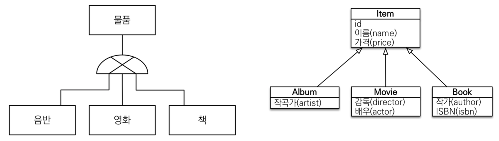
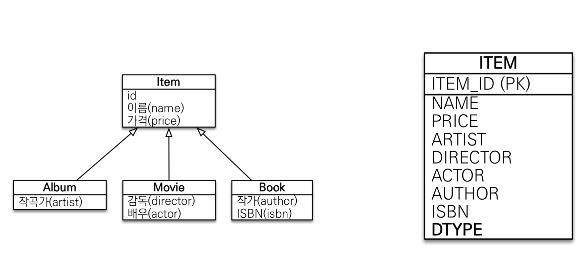
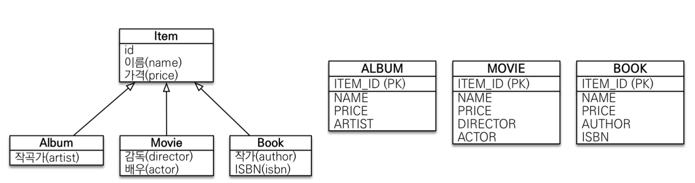
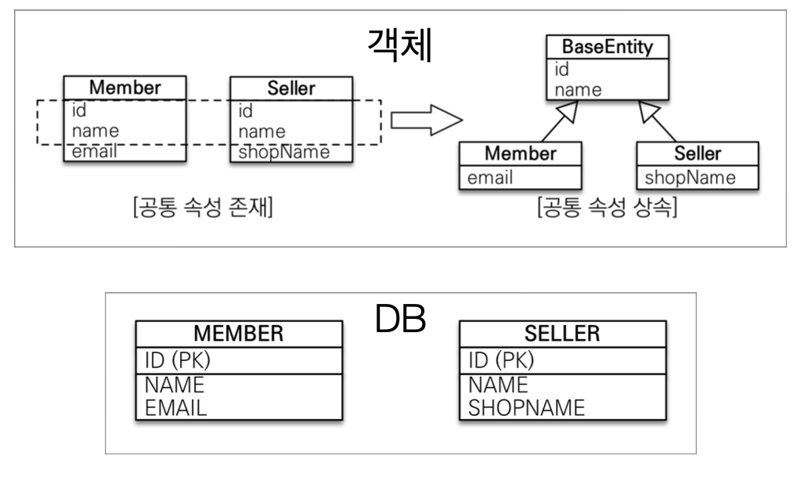

# Chapter7. 고급 매핑

## 7.1 상속 관계 매핑

관계형 데이터베이스에는 객체지향 언어에서 다루는 상속이라는 개념이 없다. 
대신 Super-type Sub-type Relationship (슈퍼타입 서브타입 관계) 라는 모델링 기법이 있고 이는 객체의 상속 개념과 가장 유사하다. 
**ORM 에서 말하는 상속관계 매핑은 객체의 상속 구조와 데이터베이스의 슈퍼타입 서브타입 관계를 매핑하는 것이다.**



- 슈퍼타입 서브타입 논리 모델을 물리 모델인 테이블로 구현하는 방법 
  1. 각각의 테이블로 변환 **(JPA : 조인 전략)**
  2. 통합 테이블로 변환 **(JPA : 단일 테이블 전략)**
  3. 서브타입 테이블로 변환 **(JPA : 구현 클래스마다 테이블 전략)**


- 주 어노테이션
  - `@Inheritance(strategy=InheritanceType.XXX)`

    **JOINED**: 조인 전략
    **SINGLE_TABLE**: 단일 테이블 전략
    **TABLE_PER_CLASS**: 구현 클래스마다 테이블 전략 

  - `@DiscriminatorColumn(name=“DTYPE”)`

    - 부모 클래스에 자식 테이블 구분 컬럼명

  - `@DiscriminatorValue(“XXX”)`

    - 엔티티에 저장할 때 구분 컬럼에 입력할 값 지정 
    - 예를 들어 영화 테이블이면 "M" 
    - default는 엔터티 이름이다

```java
@Entity 
@Inheritance(strategy = InheritanceType.XXX) // 상속 구현 전략 선택 
public class Item { 
	@Id @GeneratedValue(strategy = GenerationType.IDENTITY) 
  private Long id; 
  private String name; 
  private int price; 
}
```

- 객체 상속 관계는 변경하지 않고 전략이 바뀜에 따라 테이블 구조가 달라짐


> 조인 전략

- 장점
  - 테이블 정규화
  - 외래 키 참조 무결성 제약조건 활용가능
  - 저장공간 효율화
- 단점
  -  조회 시조인을 많이 사용, 성능저하
  - 조회 쿼리가 복잡함
  - 데이터 저장시 INSERT SQL 2번 호출


> 단일 테이블 전략

- 장점
  - 조인이 필요 없으므로 일반적으로 조회 성능이 빠름
  - 조회 쿼리가 단순함
- 단점
  - 자식 엔티티가 매핑한 컬럼은 모두 null 허용
  - 단일테이블에모든것을저장하므로테이블이커질수있다.상 황에 따라서 조회 성능이 오히려 느려질 수 있다.

정말 간단한 개념이고 비즈니스 로직에서도 중요하지 않을 때 많이 사용함.




```sql
Hibernate: 
    
    create table Item (
       DTYPE varchar(31) not null,
        ITEM_ID bigint not null,
        name varchar(255),
        price integer not null,
        stockQuantity integer not null,
        actor varchar(255),
        director varchar(255),
        author varchar(255),
        isbn varchar(255),
        artist varchar(255),
        etc varchar(255),
        primary key (ITEM_ID)
    )
```


> 구현 클래스마다 테이블 전략

**이 전략은 데이터베이스 설계자와** **ORM** **전문가 둘 다 추천 X**

- 장점
  - 서브 타입을 명확하게 구분해서 처리할 때 효과적
  - not null 제약조건 사용 가능
- 단점
  - 여러 자식 테이블을 함께 조회할 때 성능이 느림(UNION SQL 필요)
  - 자식 테이블을 통합해서 쿼리하기 어려움





## 7.2 @MappedSuperclass

- 공통 매핑 정보가 필요할 때 사용 (id, name)



- 상속 관계 매핑이 아니다
- 엔터티가 아니다
- 테이블과 매핑되지 않는다
- 직접 생성해서 사용할 일이 없으면 abstract를 붙여 추상 클래스로 사용할 것을 권장한다
  - 안 붙이면 테이블 생성됨
- 엔터티가 아니므로 조회 및 검색이 불가능하다
- 부모 클래스를 상속받는 자식 클래스에 **매핑 정보만 제공한다**
- CreatedBy, CreatedDate, LastModifiedBy, LastModifiedDate  많이 사용 함
  - auditing 나중에 배움


> MappedSuperClass 정리

- 테이블과 관계 없고, 단순히 엔티티가 공통으로 사용하는 매핑 정보를 모으는 역할

- 등록일, 수정일, 등록자, 수정자 같은 전체 엔티티에서 공통으로 적용하는 정보를 모을 때 사용

- 참고로 @Entity 클래스는 엔티티나 @MappedSuperClass로 지정한 클래스만 상속 가능

  - ```
    @Entity
    public class Member extends {@Entity or @MappedSuperClass 어노티에션이 달려있는 클래스}
    ```

    

> 예제

```java
@Getter 
@Setter 
@MappedSuperclass 
public abstract class BaseEntity {
  private String createdBy; 
  private LocalDateTime createdDate; 
  private String lastModifiedBy; 
  private LocalDateTime lastModifiedDate; 
}
```

```java
@Entity 
public class Member extends BaseEntity { ... } 
@Entity 
public class Team extends BaseEntity { ... }
```


```sql
Hibernate: 
create table Member ( 
  id bigint generated by default as identity, 
  createdBy varchar(255), 
  createdDate timestamp, 
  lastModifiedBy varchar(255), 
  lastModifiedDate timestamp, 
  name varchar(255), 
  team_id bigint, primary key (id) 
) 
Hibernate: create table Team ( 
  id bigint generated by default as identity, 
  createdBy varchar(255), 
  createdDate timestamp, 
  lastModifiedBy varchar(255), 
  lastModifiedDate timestamp, 
  name varchar(255), primary key (id) 
)
```


## 7.3 복합 키와 식별 관계 매핑


## 7.4 조인 테이블


## 7.5 엔티티 하나에 여러 테이블 매핑

