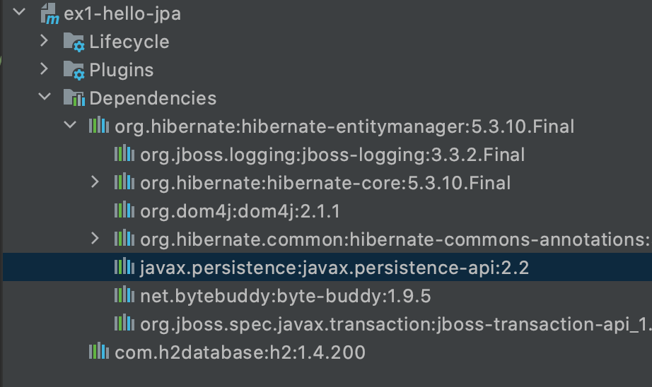

# JPA 시작하기

## Hello JPA - 프로젝트 생성

### 목차
1. Dependency 추가
2. persistence.xml 작
---
1. Dependency 추가
    1. Hibernate
    2. DB driver
    
    
    
    - javax.persistence-api
        - JPA의 구현체로 hibernate를 선택했음. 실제로 사용할 JPA interface가 해당 라이브러리에 들어가 있음.
    - H2 데이터베이스 버전 맞추기
        - 설치한 DB버전이랑 디펜던시 버전이랑
    - Hibernate [5.3.10.Final](http://5.3.10.Final) 을 선택한 이유는?
        - JPA 단독으로 사용할 수 있지만 보통 Spring Framework랑 같이 사용한다. 그래서 라이브러리 버전을 선택할 때 [공식 문서](https://spring.io/projects/spring-boot#learn)가서 내가 사용 할 Spring Boot 버전을 찾고 그에 맞는 라이브러리 버전 확인하기
            
            링크 : [Dependency Versions](https://docs.spring.io/spring-boot/docs/current/reference/html/dependency-versions.html#dependency-versions)
            
            
            

2. `persistence.xml` 작성

```xml
<?xml version="1.0" encoding="UTF-8"?>
<persistence version="2.2"
  xmlns="http://xmlns.jcp.org/xml/ns/persistence" xmlns:xsi="http://www.w3.org/2001/XMLSchema-instance"
  xsi:schemaLocation="http://xmlns.jcp.org/xml/ns/persistence http://xmlns.jcp.org/xml/ns/persistence/persistence_2_2.xsd">
  <persistence-unit name="hello">
    <properties>
      <!-- 필수 속성 -->
      <property name="javax.persistence.jdbc.driver" value="org.h2.Driver"/>
      <property name="javax.persistence.jdbc.user" value="sa"/>
      <property name="javax.persistence.jdbc.password" value=""/>
      <property name="javax.persistence.jdbc.url" value="jdbc:h2:tcp://localhost/~/test"/>
      <property name="hibernate.dialect" value="org.hibernate.dialect.H2Dialect"/>
      <!-- 옵션 -->
      <property name="hibernate.show_sql" value="true"/>
      <property name="hibernate.format_sql" value="true"/>
      <property name="hibernate.use_sql_comments" value="true"/>
      <!--<property name="hibernate.hbm2ddl.auto" value="create" />-->
    </properties>
  </persistence-unit>
</persistence>
```

- 데이터베이스 방언 dialect
    - JPA는 특정 DB에 종속 X
    - **SQL 표준을 지키지 않는 특정 데이터베이스 만의 고유한 기능**
- h2 dialect 예시
    
    
    
- 오라클은 limit 이 아니라 rownum을 씀 아래 예시
    
    
    
- javax.persistence.xx
    - 다른 구현체를 써도 설정 동일
- hibernate.xxx
    - hibernate 전용 옵션임. 다른 구현체 사용 시 수정 필요

회사에서 진행했던 JPA를 이용한 프로젝트에서 JPA 구현체로 하이버네이트를 사용하겠다는 설정이 없었는데 어떻게 된거지?

> ["By default Spring uses Hibernate as the default JPA vendor. If you prefer, you can use any other reference implementation e.g. EclipseLink for the Java Persistence in your Spring project. "](https://stackoverflow.com/questions/41902856/spring-boot-jpa-hibernate-as-default) 
Default가 하이버네이트라고 한다.
>