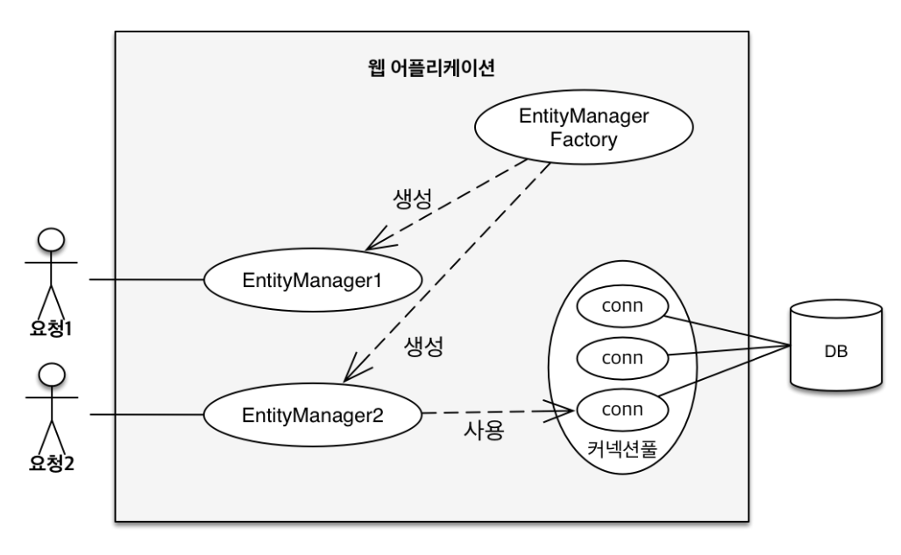

# 영속성 관리 - 내부 동작 방식

### JPA 에서 가장 중요한 2가지

1. 객체와 관계형 DB 매핑 (Object Relational Mapping)
    - 설계
2. 영속성 컨텍스트
    - 내부적으로 어떻게 동작하는지

# 영속성 컨텍스트 1

- 새로운 요청이 올 때마다 EntityManager를 생성한다



## 영속성 컨텍스트

- 엔터티를 영구 저장하는 논리적인(logical) 환경
- `EntityManager.persist(entity);` : 영속성 컨텍스트에 저장
- EntityManager을 통해 영속성 컨텍스트에 접근한다
- EntityManager와 영속성 컨텍스트가 1:1 (J2SE환경 ?)
    - EntityManager 1 : 1 PersistenceContext

## 엔터티의 생명주기

- 비영속(new/transient)
    - Persistence Context와 전혀 관계가 없는 새로운 상태
- 영속(managed)
    - Persistence Context에 관리되는 상태
- 준영속(detached)
    - Persistence Context에 저장되었다가 분리된 상태
- 삭제(removed)
    - 삭제된 상태


```java
// 객체를 생성한 상테(비영속)
Member member = new Member();
member.setId(1L);
member.setName("회원1");
    
// 객체를 저장한 상태(영속)
em.persist(member);

// 준영속 detached
em.detach(member);

// 객체를 삭제한 상태
em.remove(member);
```

---

em.persist 했을 때 쿼리가 실행되는 것이 아님

commit() 할 때 실행 됨.

em.remove() 는 실제로 지우는 코드 

flush() ?

---

## Persistence Context의 이점

### 1. 엔터티 조회, 1차 캐시

- 일단 EntityManager를 Persistence Context 라고 여기기
- JPA는 `em.find(Member.class, "member1");` 을 하면 DB를 조회하지 않고 1차 캐시에서 먼저 조회함
- 사실 그렇게 이득이 있지 않음. 찰나의 순간에서 이점이 있지만 한 트랜잭션 안에서 만 효과가 있음

> 예제1
> 

```java
package hellojpa;

import javax.persistence.EntityManager;
import javax.persistence.EntityManagerFactory;
import javax.persistence.EntityTransaction;
import javax.persistence.Persistence;

public class JpaMain{
  public static void main(String[] args){
    EntityManagerFactory emf = Persistence.createEntityManagerFactory("hello");

    EntityManager em = emf.createEntityManager();

    EntityTransaction tx = em.getTransaction();

    tx.begin();

    try{
      // 비영속
      Member member = new Member();
      member.setId(101L);
      member.setName("1차 캐시 조회 테스트");

      // 영속
      em.persist(member);

      Member findMember = em.find(Member.class, 101L);

      System.out.println("member.id = " + findMember.getId());
      System.out.println("member.name = " + findMember.getName());

      tx.commit();
    } catch (Exception e){
      tx.rollback();
    } finally {
      em.close();
    }
    emf.close();
  }
}
```

- 결과는 ?
    
    ```java
    member.id = 101
    member.name = 1차 캐시 조회 테스트
    Hibernate: 
        /* insert hellojpa.Member
            */ insert 
            into
                Member
                (name, id) 
            values
                (?, ?)
    ```
    
    - DB select 쿼리가 안 나감.
    - 1차 캐시에서 먼저 조회했기 때문

> 예제2
> 

```java
Member findMember1 = em.find(Member.class, 101L);
Member findMember2 = em.find(Member.class, 101L);

System.out.println("member.id = " + findMember1.getId());
System.out.println("member.name = " + findMember1.getName());
```

- 결과
    
    ```java
    Hibernate: 
        select
            member0_.id as id1_0_0_,
            member0_.name as name2_0_0_ 
        from
            Member member0_ 
        where
            member0_.id=?
    member.id = 101
    member.name = 1차 캐시 조회 테스트
    ```
    
    - select 쿼리가 한 번 나감.

## 2. 영속 엔터티의 동일성 보장

> 예제 1
> 

```java
Member findMember1 = em.find(Member.class, 101L);
Member findMember2 = em.find(Member.class, 101L);

System.out.println(findMember1 == findMember2);
```

- 결과
    - true
- 설명
    - 1차 캐시로 repeatable read (반복가능한 읽기) 등급의 트랜잭션 격리 수준을 DB가 아닌 애플리케이션 차원에서 제공해 준다.
    - 같은 트랜잭션에서 비교를 하면 동일성이 보장된다.

## 3. 엔터티 등록시 트랜잭션을 지원하는 쓰기 지연

```java
EntityManager em = emf.createEntityManager();
EntityTransaction transaction = em.getTransaction();//엔티티 매니저는 데이터 변경시 트랜잭션을 시작해야 한다.

transaction.begin(); // [트랜잭션] 시작

em.persist(memberA); // == 1차 캐시에 저장 & insert SQL 생성
em.persist(memberB); // == 1차 캐시에 저장 & insert SQL 생성
///여기까지 INSERT SQL을 데이터베이스에 보내지 않는다.

//커밋하는 순간 데이터베이스에 INSERT SQL을 보낸다.
transaction.commit(); // [트랜잭션] 커밋
// ==> flush -> db transaction commit
```

- buffer에 모아서 한 번에 commit 이 가능하다.